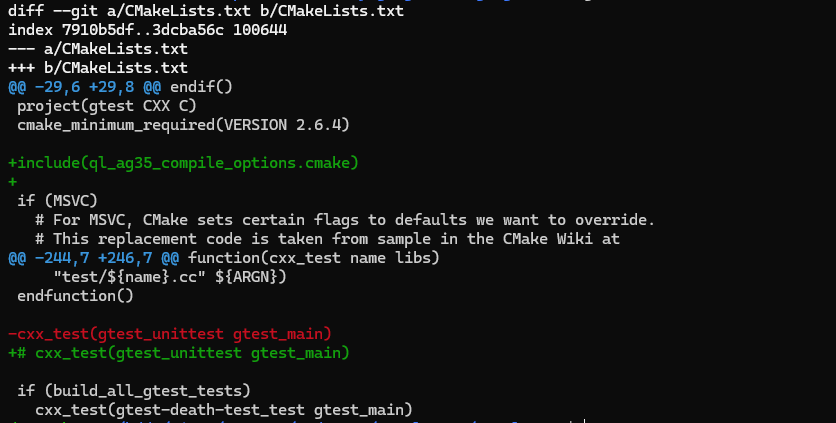

# googletest集成指南
若需要编译，仅需两步：
1. 打开编译选项

   `Sparrow/Build/options/{platform}/{platform}_complie_options.cmake`, 将 `BUILD_GTEST` 设置为 `ON`，并保存。 例：
   ```cmake
   ## Sparrow/Build/options/Default/Default_compile_options.cmake
   set(BUILD_GTEST ON)
   ```
2. 集成`gtest`库文件
* ubuntu平台
   ```shell
    $ cd Sparrow/3rdParty/googletest
    $ tar -zxvf googletest-1.5.0.tar.gz
    $ mkdir -p googletest/build
    $ cd googletest/build
    $ cmake ..
    $ make
    $ cp libgtest* ../../lib/Default/ -rf
   ```
* 需交叉编译平台

    解压googletest-1.5.0.tar.gz并交叉编译，放置googletest/lib/{platform}目录下。
    示例：
    
- 注:
    - `platform` 对应不同的交叉编译平台。
    - 若不使用`googletest-1.5.0.tar.gz`，需要同步更新`Sparrow/3rdParty/googletest/include/`头文件。