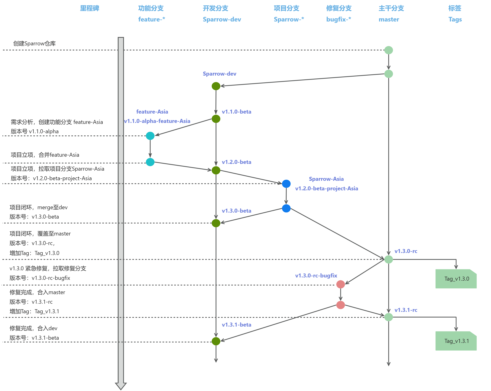

# 版本管理

## 更新记录

| 版本号 | 日期       | 修改人       | 更新内容 |
| ------ | ----------| ----------- | -------- |
| 1.0.0  | 2025-01-21| LinuxTaoist | 初始版本 |
| 1.1.0  | 2025-05-23| LinuxTaoist | 2.3 分支拉取规则更新

## 1. 引言
### 1.1 目的
  定义版本管理规范，统一版本命名规则。

### 1.2 适用范围
  当前项目所有版本管理，包括功能开发、项目发布、紧急修复全流程。

## 2. 分支管理方案
### 2.1 分支命名规则
| 分支名   | 说明 |
| ----------  | --- |
| master      | 主版本。永远支持量产能力|
| Sparrow-dev | 开发迭代分支。源自master，用于所有功能开发的起点。|
| feature-*   | 功能分支。源自Sparrow-dev，用于开发新特性。完成后合并至Sparrow-dev，合并后立即删除|
| Sparrow-*   | 项目分支。源自Sparrow-dev，用于立项后的项目开发。完成后合并至Sparrow-dev 和 master，合并后立即删除|
| bugfix-*    | 修复分支。<br>- 源自master：修复量产分支紧急问题 <br>- 源自Sparrow-dev：修复开发中问题<br>修复后合并至对应源分支和Sparrow-dev，合并后立即删除|

### 2.2 版本号规则: X.Y.Z-[build]
示例:1.3.0-alpha，路径 `version.cmake`
```
# 版本信息
set(VERSION_MAJOR 1)
set(VERSION_MINOR 3)
set(VERSION_REVISION 0)
set(VERSION_PRELEASE "alpha")
```
* X: 主版本号。当做了架构上调整或不兼容的 API 修改。
* Y: 次版本号。当添加了向下兼容的功能性新增。
* Z: 修订版本号。当做了向下兼容的问题修正。
* build: 编译版本号。用于开发阶段编译版本标识，正式发布版本不包含此字段。
    * alpha(内部测试版): 初期测试阶段，主要由内部进行功能验证和缺陷排查。
    * beta(公测版): 发布给外部用户试用，收集反馈并改进，准备最终发布的阶段。
    * rc (Release Candidate，候选发布版): `beta` 测试后，修复所有已知关键问题的预发布版本，通常非常接近最终产品。
    * 正式发布版: 完成所有测试，必须去掉预发布后缀，如 `1.3.0`。

### 2.3 分支拉取规则
从功能开发到最终发布，分支拉取与版本号变迁规则如下:
- 功能开发 (未立项)
    - 从 `Sparrow-dev` 拉取分支 `feature-xxx`分支。
    -  `feature-xxx` 中 **X.Y.Z版本号不变**，`build` 设为 `alpha.feature-xxx` (例 1.2.0-beta -> 1.2.0-alpha.feature-timemanager)。
- 功能闭环 (未立项)
    - 提交PR合并`feature-xxx` 到 `Sparrow-dev`，必须经过代码审查，使用`--no-ff`合并。
    - 合并时，依据与 `Sparrow-dev` 差异影响将`X 或 Y` + 1，移除`.feature-xxx` 后缀，`Sparrow-dev` 版本号变为 `1.3.0-beta`。
    - 删除 `feature-xxx`分支。
- 项目立项  (确定分支名Sparrow-Asia)
    - 从`Sparrow-dev` 拉取项目分支 `Sparrow-Asia`。
    - `Sparrow-Asia` 中 **X.Y.Z版本号不变**，`build` 设为 `beta.project-Asia` (例 1.3.0-beta -> 1.3.0-beta.project-Asia)。
- 项目闭环
    - 在`Sparrow-Asia`分支上，依据与 `Sparrow-dev` 差异影响将`X 或 Y` + 1，移除`.project-Asia`后缀 (例 1.3.0-beta.project-Asia -> 1.4.0-beta)。
    - 提交PR合并`Sparrow-Asia` 分支到 `Sparrow-dev` 分支，必须经过代码审查，使用`--no-ff`合并。
    - 将 `Sparrow-Asia` 分支覆盖到 `master` 分支（确保代码100%与测试版本一致）。
    - `master` 分支 **X.Y.Z版本号与Sparrow-Asia**保持一致，`build` 设为 `rc` (例 1.4.0-beta -> 1.4.0-rc)。
    - 删除`Sparrow-Asia` 分支。
    - 更新 `CHANGELOG`，打上tag `Tag_v1.4.0`。
- 量产紧急修复
    - 从 `master` 拉取分支 `bugfix-xxx` 分支。
    - `bugfix-xxx` 中 **X.Y.Z版本号不变**，`build` 设为 `rc.bugfix-xxx` (例 1.4.0-rc -> 1.4.0-rc.bugfix-crash-123)。
    - Bug 验证完毕，在`bugfix-xxx`分支上将`Z + 1`，移除`.bugfix-xxx`后缀 (例: 1.4.0-rc.bugfix-crash-123 -> 1.4.1-rc)。
    - 将 `bugfix-xxx` 分支覆盖到 `master` 分支（确保代码100%与测试版本一致）。
    - 更新 `CHANGELOG`；打上tag `Tag_v1.4.1`。
    - 提交PR合并`bugfix-xxx` 至 `Sparrow-dev`，必须经过代码审查，使用`--no-ff`合并。
    - `Sparrow-dev` 分支 **X.Y.Z版本号与bugfix-xxx** 保持一致，`build` 设为 `beta` (例 1.4.1-rc -> 1.4.1-beta)。
- 开发中问题修复
    - 从 `Sparrow-dev` 拉取分支 `bugfix-xxx` 分支（修复开发中beta版本问题）。
    - `bugfix-xxx` 中 **X.Y.Z版本号不变**，`build` 设为 `beta.bugfix-xxx` (例: 1.4.1-beta -> 1.4.1-beta.bugfix-ui-456)。
    - Bug 验证完毕，在`bugfix-xxx`分支上将`Z + 1`，移除`.bugfix-xxx`后缀 (例: 1.4.1-beta.bugfix-ui-456 -> 1.4.2-beta)。
    - 提交PR合并`bugfix-xxx` 分支到 `Sparrow-dev` 分支，必须经过代码审查，使用`--no-ff`合并。
    - 删除`bugfix-xxx`分支。

### 2.4 标准流程 (图示)



## 3. 发布流程
### 3.1 Sparrow-dev分支发布

I. 合并 `feature-xxx`分支到 `Sparrow-dev`。
```shell
cd Sparrow
git checkout remotes/origin/Sparrow-dev -b dev
git merge remotes/origin/feature-xxx
```

II. 修改`Sparrow-dev`版本号<br>
VERSION_PRELEASE "beta"
```
vim version.cmake

# 版本信息
set(VERSION_MAJOR 1)
set(VERSION_MINOR 8)
set(VERSION_REVISION 2)
set(VERSION_PRELEASE "beta")
```

III. 修改CHANGELOG <br>
参照历史，备注当前版本差异项

IV. 提交PR合并`Sparrow-dev`
```
Update Version 1.8.2-beta: 合入功能分支feature-xxx

【详细描述】版本更新
- 增加通用协议解析模块CodecX
- 增加调试Web界面HttpUISrv
- 增加sprrow main框架SprMain
- 去除冗余内部消息ID

【修改类型】Optimize
【问题链接】N/A
【项目关联】Default
```

V. 更新 Sparrow 版本迭代图

### 3.2 master分支发布
大致流程与 [章节 3.1](#31-sparrow-dev分支发布) 相同：<br>

I. 合并 `Sparrow-xxx`分支到 `master` <br>
   完全覆盖至`master`，确保代码100%与测试版本一致。

   ```git
   git switch master
   git rm -rf .
   git checkout Sparrow-xxx -- .
   git add .
   git commit
   git push origin master
   ```

II. 修改`master`版本号 <br>
VERSION_PRELEASE "rc"
```
vim version.cmake

# 版本信息
set(VERSION_MAJOR 1)
set(VERSION_MINOR 8)
set(VERSION_REVISION 3)
set(VERSION_PRELEASE "rc")
```

III. 修改CHANGELOG <br>
参照历史，备注当前版本差异项

IV. 提交PR合并`master`
```
Update Version 1.8.2-rc: 合入功能分支feature-xxx

【详细描述】版本更新
- 增加通用协议解析模块CodecX
- 增加调试Web界面HttpUISrv
- 增加sprrow main框架SprMain
- 去除冗余内部消息ID

【修改类型】Optimize
【问题链接】N/A
【项目关联】Default
```

V. 更新 Sparrow 版本迭代图

## 4. CHANGELOG 规范
```shell
## vX.Y.Z (YYYY-MM-DD)
### 新增
- 新增XXX功能
### 修复
- 修复XXX问题（关联bug编号）
### 变更
- 调整XXX逻辑
```

参考 [CHANGELOG](../../CHANGELOG)

## 5. 提交模版
参考 [.git-commit-template](../../.git-commit-template)

## Q&A
### Q: 从开发分支向 master 分支合并代码，采用直接覆盖策略的原因是什么？
**A：**
`master` 为量产主干，需随时可发布。开发分支已完成充分测试，直接覆盖可避免 `merge` 引入额外变更与潜在问题，保障主干版本稳定可靠。
