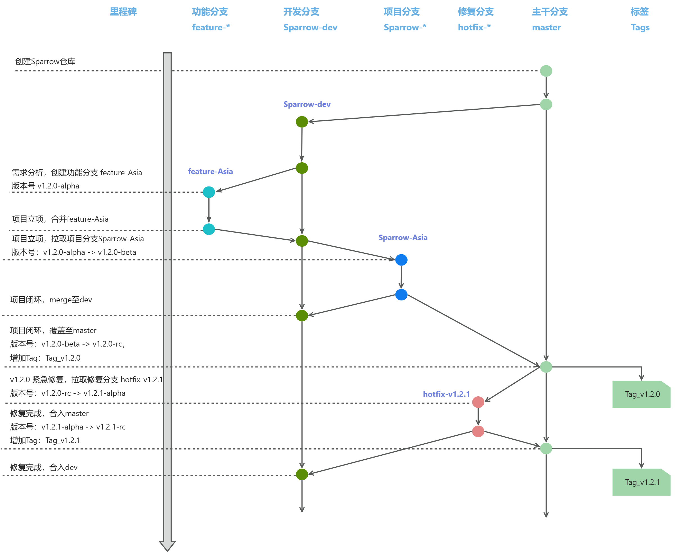

# 版本管理

## 更新记录

| 版本号 | 日期       | 修改人       | 更新内容 |
| ------ | ----------| ----------- | -------- |
| 1.0.0  | 2025-01-21| LinuxTaoist | 初始版本 |

## 1. 引言
### 1.1 目的
  定义版本管理规范,统一版本命名规则。

### 1.2 适用范围
  当前项目所有版本管理。

## 2. 分支管理方案
### 2.1 分支命名规则
| 分支名   | 说明 |
| ----------  | --- |
| master      | 主版本。永远支持量产能力|
| Sparrow-dev | 开发迭代分支。源自master, 用于所有功能开发的起点。|
| feature-*   | 功能分支。源自Sparrow-dev, 用于开发新特性。完成后合并至Sparrow-dev, 并评估是否删除。|
| Sparrow-*   | 项目分支。源自Sparrow-dev, 用于立项后的项目开发。完成后合并至Sparrow-dev 和 master, 并评估是否删除。|
| bugfix-*    | 修复分支。源自master, 修复量产分支问题,修复后合并至Sparrow-dev和master, 并评估是否删除。|

### 2.2 版本号规则: X.Y.Z-[build]
示例:1.3.0-alpha, 路径 `version.cmake`
```
# 版本信息
set(VERSION_MAJOR 1)
set(VERSION_MINOR 3)
set(VERSION_REVISION 0)
set(VERSION_PRELEASE "alpha")
```
* X: 主版本号。当做了架构上调整或不兼容的 API 修改。
* Y: 次版本号。当添加了向下兼容的功能性新增。
* Z: 修订号。当做了向下兼容的问题修正。
* build: 编译版本号。用于开发阶段编译版本标识,正式发布版本不包含此字段。
    * alpha(内部测试版): 初期测试阶段,主要由内部进行功能验证和缺陷排查。
    * Beta(公测版): 发布给外部用户试用,收集反馈并改进,准备最终发布的阶段。
    * rc (Release Candidate, 候选发布版): Beta 测试后,修复所有已知关键问题的预发布版本,通常非常接近最终产品。
    * GA (General Availability, 正式发布版): 完成所有测试,面向公众正式发布的稳定版本,等同于不带任何后缀的版本号。

### 2.3 分支拉取规则
从功能开发到最终发布, 分支拉取规则如下:
- 需求分析期 (未立项)
    - 从 `Sparrow-dev` 拉取分支 `feature-xxx`分支。
    -  `feature-xxx` 中 `version.cmake` 分支次版本号 +1，编译版本号设为`alpha` (例 1.2.0-rc -> 1.3.0-alpha)。
- 项目立项 （确定分支名Sparrow-Asia）
    - 合并`feature-xxx` 到 `Sparrow-dev`， 删除 `feature-xxx`。
    - 然后从`Sparrow-dev` 拉取项目分支 `Sparrow-Asia`。
    - `Sparrow-Asia` 中 `version.cmake` 版本号不变，编译版本号为 `Beta` (1.3.0-alpha -> 1.3.0-Beta)。
- 项目闭环
    - merge `Sparrow-Asia` 分支到 `Sparrow-dev` 分支。
    - 同时将 `Sparrow-Asia` 分支覆盖到 `master` 分支，删除 `Sparrow-Asia` 分支。
    - `master` 分支中 `version.cmake` 版本号不变，编译版本号为`rc` (1.3.0-Beta -> 1.3.0-rc)；更新 `CHANGELOG`；打上tag(例: Tag_v1.3.0)。
- 紧急修复
    - 从 `master` 拉取分支 `bugfix-xxx` 分支。
    - `bugfix-xxx` 分支中 `version.cmake` 修订号 +1，编译版本号设为 `alpha` (例 1.3.0-rc -> 1.3.1-alpha)。
    - 验证完毕后合并至 `Sparrow-dev` 和 `master` 分支。
    - `master` 分支中 `version.cmake` 版本号不变，编译版本号为`rc` (1.3.0.1-alpha -> 1.3.1-rc)；更新 `CHANGELOG`；打上tag (例: Tag_v1.3.1)。

**标准流程 (图示)**



## 发布流程
[TODO]
