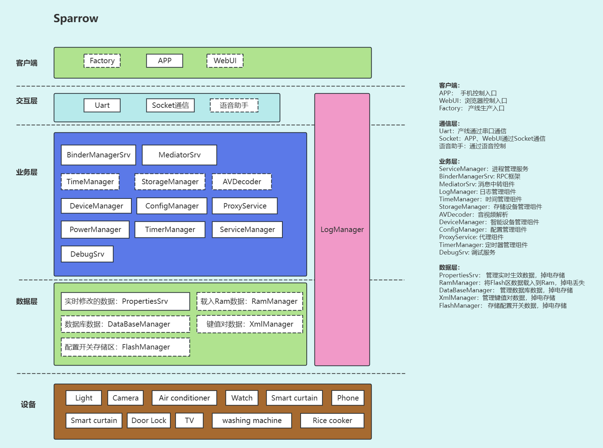

## 介绍
Sparrow是一个用于嵌入式Linux中间件系统，旨在为嵌入式Linux应用开发快速构建一套中间件框架。


## 软件架构
采用微服务架构，将系统拆分为多个独立模块，每个模块负责不同的功能，模块之间通过消息队列通信。

初步框架构思如下：



<span style="font-size: 12px;">
<span style="color: blue;">注：架构图随版本迭代随时更新</span>
</span>


## 应用场景
本项目设计一款针对嵌入式Linux环境的高度可定制与可移植的中间件架构。通过深度模块化策略，集成了丰富多样的通用功能模块，已满足日常开发所需。在保障每个模块独立性和互操作性的前提下，不仅在代码层面实现严格解耦，还在构建脚本中清晰地映射出模块间的依赖关系，最大可能简化跨平台移植过程，提升了整体的开发效率和灵活性。

本项目可适用于智能硬件、消费电子、智能家居系统及车载娱乐信息系统等嵌入式Linux环境下的产品开发。


## 目录

```c++
Sparrow
├── 3rdAdapter          // 第三方软件适配接口
├── 3rdParty            // 第三方软件库
├── Build               // 构建脚本
├── CMakeLists.txt
├── Components          // 独立组件
├── Core                // 核心框架
├── Debug               // 调试工具
├── Docs                // 文档
├── Examples            // 示例
├── Hardware            // 硬件适配接口
├── LICENSE             // 许可证
├── PrivateAPIs         // 内部公开接口
├── ProjectConfigs      // 项目配置
├── PublicAPIs          // 外部公开接口
├── README.en.md
├── README.md
├── Release             // 发布路径
├── StaticScans         // 静态扫描修复纪录
├── Tools               // 常用辅助脚本/可执行程序
├── Util                // 通用工具函数
├── UtilModules         // 通用模块库
└── version.cmake       // 版本信息
```

## 使用教程

### 环境
当前项目本地开发环境如下，尽量与本环境保持一致，否则会编译报错。
```Shell
C++ Standard   : 14
G++ Version    : 11.4.0
Gcc Version    : 11.4.0
Build Platform : Ubuntu 22.04.2 LTS
```

### 编译
① 编译第三方库

由于集成了第三方库，第一次编译时，需要先交叉编译第三方库，确保依赖库生成，再进行项目编译。

<span style="font-size: 12px;">
<span style="color: blue;">注：如需不同嵌入式平台，需要配置交叉编译工具链。</span>
</span>

```Shell
$ cd 3rdParty
$ ./build_3rdparty.sh
```

② 编译sparrow
```Shell
$ cd Build
$ ./general_build.sh
```

③ 版本生成路径
```shell
$ cd Release/
$ ls -al
Bin  Cache  Lib
```

## 第三方库依赖
|    第三方库   | 依赖模块     | 备注 |
| -----------   | -----------  | -- |
|libgo	        | 所有组件     | 以协程代替协程方式实现事件驱动模型   |
|sqlite	        | ConfigManager| 用于项目运行中的关键配置等数据存储|


## 文档

项目进行过程中会输出一些文档，用于记录开发的一些细节、疑惑和值得记录的关键解决方案等。
```
Docs/
├── C++编程规范.md
├── Issue提交规范.md
├── Sparrow Q&A.md
├── TODO.md
├── png
├── 注意事项.md
├── 疑难杂症.md
└── 第三方依赖.md
```

**需要关注的文档**

- C++编程规范.md   
项目代码规范参考依据，并非完全一致，编程风格优先于项目已存在代码保持一致。
- Issue提交规范.md   
Github/Gitee Issue提交模板参考。

## 最后
本项目的初心在于：既然做了这一行那就尽力做好，不断地积累不断地丰富开发技能。所谓的大佬，都是一个一个问题给“坑”出来的。敢于展示自己的代码，敢于接受别人的批评，敢于直面自己的不足，方能不断进步。

另外，本项目仅是个人有限开发经验的简单体现，一定存在诸多不足。欢迎各位大佬提出宝贵意见，共同完善本项目。

