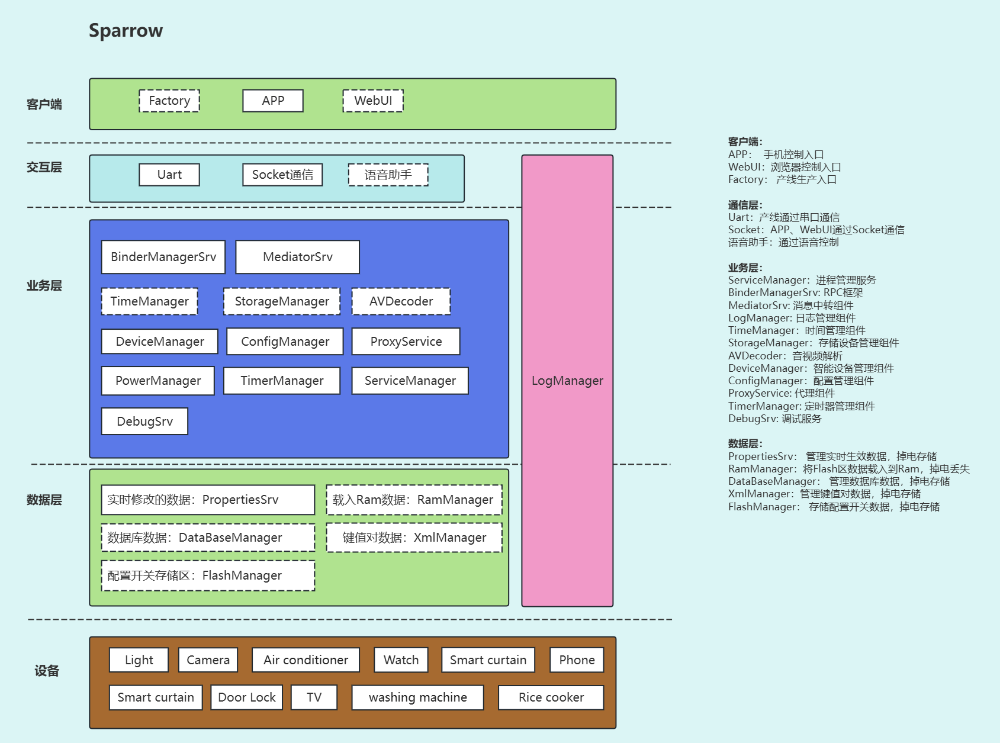

## 介绍
`Sparrow`是一款基于事件驱动模型的`Linux`中间件框架。采用微服务架构，旨在快速构建高效的`Linux C++`中间件应用框架。

## 应用场景
* 智能硬件：如智能灯泡、智能插座、智能摄像头、机器人控制系统等，适用于需要高效通信与控制的设备。
* 消费电子：例如智能手表、健康监测手环、智能电视等，支持数据收集、分析及用户界面管理。
* 车载系统：包括车载T-Box、智能座舱等，提供导航、娱乐、电话连接等功能，增强驾驶体验。
* 物联网（IoT）：涵盖智能家居、环境检测、物联网网关等，实现设备互联、数据收集与处理。

## 软件架构
采用微服务架构，将系统功能分解为多个独立模块，每个模块负责特定功能。模块间通过消息发布-订阅机制进行通信，确保高度解耦与灵活扩展。

初步框架构思如下：



<span style="font-size: 12px;">
<span style="color: blue;">注：架构图随版本迭代随时更新</span>
</span>


## 源码目录

```c++
Sparrow/
├── 3rdAdapter                // 第三方软件适配接口
├── 3rdParty                  // 第三方软件库
├── Build                     // 构建脚本
├── CMakeLists.txt
├── Components                // 独立组件
├── Core                      // 核心框架
├── Debug                     // 调试工具
├── Docs                      // 文档
├── Examples                  // 示例
├── Hardware                  // 硬件适配接口
├── LICENSE                   // 许可证
├── PrivateAPIs               // 内部公开接口
├── ProjectConfigs            // 项目配置
├── PublicAPIs                // 外部公开接口
├── README.en.md
├── README.md
├── Release                   // 发布路径
├── StaticScans               // 静态扫描修复纪录
├── Test                      // 测试用例
├── Tools                     // 常用辅助脚本/可执行程序
├── Util                      // 通用工具函数
├── UtilModules               // 通用模块库
├── modules_configs.cmake     // 模块配置
└── version.cmake             // 版本信息
```

## 使用教程

### 环境
当前项目本地开发环境如下，尽量与本环境保持一致，否则可能会编译报错。
```Shell
C++ Standard   : 11
G++ Version    : 11.4.0
Gcc Version    : 11.4.0
Build Platform : Ubuntu 18.04.6 LTS
```

### 编译
① 编译sparrow
```Shell
$ cd Build
$ ./final_general_build.sh
```

② 版本生成路径
```shell
$ cd Release/
$ ls
Bin  Cache  Include  Lib
```

③ 程序执行

项目编译完成后，会在`Release/Bin`目录下生成可执行程序。通过执行`servicemanager`程序会自动拉起所有的服务，并启动服务监控。拉起服务配置参考`Release/Bin/init.conf`。

### 启动服务
```shell
$ ./servicemanagersrv
192  ServiceM D: service: logmanagersrv        pid:  70542
238  ServiceM D: Waiting exe: logmanagersrv        retryTimes = 1
183  ServiceM D: execl logmanagersrv (1).
192  ServiceM D: service: bindermanagersrv     pid:  70543
238  ServiceM D: Waiting exe: bindermanagersrv     retryTimes = 1
183  ServiceM D: execl bindermanagersrv (1).
192  ServiceM D: service: propertiessrv        pid:  70544
238  ServiceM D: Waiting exe: propertiessrv        retryTimes = 1
183  ServiceM D: execl propertiessrv (1).
192  ServiceM D: service: mediatorsrv          pid:  70545
183  ServiceM D: execl mediatorsrv (1).
238  ServiceM D: Waiting exe: mediatorsrv          retryTimes = 1
192  ServiceM D: service: sparrowsrv           pid:  70548
183  ServiceM D: execl sparrowsrv (1).
192  ServiceM D: service: powermanagersrv      pid:  70549
183  ServiceM D: execl powermanagersrv (1).
192  ServiceM D: service: debugsrv             pid:  70550
183  ServiceM D: execl debugsrv (1).
```

### 实时查看日志
```shell
$ tail -f /tmp/sprlog/sparrow.log
07-20 10:12:59.104  70543      BinderM D:   80 Add service info(8336, powermanagersrv)
07-20 10:12:59.107  70550     EpollSch D:   36 ===========  Sparrow Epoll Start  ===========
07-20 10:12:59.112  70550     EpollSch D:   97 Poll add module 5 DebugM
07-20 10:12:59.112  70550     IpcProxy D:   74 Register observer: [0x8] [/DebugM_BymUfOrK]
07-20 10:12:59.112  70550   SprObsBase D:  241 [DebugM] - Dump common version: COMMON_TYPE_DEFS_VERSION_N1001 / COMMON_MACROS_VERSION_M1001 / CORE_TYPE_DEFS_VERSION_R1001
07-20 10:12:59.112  70550   SprObsBase D:   62 [DebugM] Start Module: DebugM, mq: /DebugM_BymUfOrK
07-20 10:12:59.112  70545  SprMediator D:  417 Register successfully! ID: 8, NAME: /DebugM_BymUfOrK, monitored = 1
07-20 10:12:59.112  70543      BinderM D:   80 Add service info(92137, debugsrv)
07-20 10:12:59.112  70545  SprMediator D:  247 Binder loop start!
07-20 10:12:59.113  70550   SprObsBase D:  255 [DebugM] Register Successfully!
```

### 内部命令集

项目集成了如下命令集，可通过`echo help > /tmp/{进程名}`查看具体进程支持命令集，回执在日志中：

* 查询 `statusmonitorsrv` 支持的命令
```Shell
$ echo help > /tmp/statusmonitorsrv
```

```C++
$ tail -f /tmp/sprlog/sparrow.log

 ==============================================================================
                      Debug Command List
 ==============================================================================
    1. Built-in Commands         Total:  2
       ├── help                : Dump all cmds
       ├── proc                : Dump process info
       └── version             : Dump version

    2. StatusMonitorManager      Total: 12
       ├── AddStatusEvent      : Add Status Event
       ├── DelAllEvent         : Del All Events
       ├── DelWithErrCode      : Del With ErrCode
       ├── DelWithID           : Del With ID
       ├── DelWithLevel        : Del With Level
       ├── DelWithText         : Del With Text
       ├── DisplayUTC          : Display UTC
       ├── DumpAllEvents       : Dump All Events
       ├── DumpWithErrCode     : Dump With ErrCode
       ├── DumpWithID          : Dump With ID
       ├── DumpWithLevel       : Dump With Level
       └── DumpWithText        : Dump With Text

 ==============================================================================
    E.g. echo help > /tmp/statusmonitorsrv
 ==============================================================================
```

* 查询 `servicemanagersrv` 支持的命令

```shell
$ echo help > /tmp/propertiessrv
```

```C++
$ tail -f /tmp/sprlog/sparrow.log

 ==============================================================================
                      Debug Command List
 ==============================================================================
    1. Built-in Commands         Total:  2
       ├── help                : Dump all cmds
       ├── proc                : Dump process info
       └── version             : Dump version

    2. Properties                Total:  1
       └── DumpAllProperties   : Dump all properties

 ==============================================================================
    E.g. echo help > /tmp/propertiessrv
 ==============================================================================
```

### 调试程序

项目同时集成了调试程序, 如下：
* infrawatch   \
实时查看各组件运行状态，需先启动`servicemanagersrv`拉起各个组件服务。
```
$ ./infrawatch
==================================  MAIN MENU  ==================================

    1. Display All Message Queues
    2. Manager's Entrance
    3. Custom Debug Options

    [Q] Quit

=================================================================================
```

* property_set、property_get    \
用于终端调试时设置和获取系统属性
```shell
$ ./property_get ro.SoftwareVersion
1.0.0
```

## 功能介绍
### 消息数据查看
### 事件监控
### 系统属性管理
### 一键退出
### 异常重启
### 崩溃堆栈捕获


## 第三方库依赖
|    第三方库   | 依赖模块     | 备注 |
| -----------  | -----------  | -- |
| sqlite       | ConfigManager| 用于项目运行中的关键配置等数据存储|
| googlettest  | Test         | 用于项目内部白盒测试、外部黑盒测试|

## 文档

项目进行过程中会输出一些文档，用于记录开发的一些细节、疑惑和值得记录的关键解决方案等。
```
Docs/
├── C++编程规范.md
├── Issue提交规范.md
├── Sparrow Q&A.md
├── TODO.md
├── png
├── share
├── spec
├── tips
├── 注意事项.md
├── 版本管理.md
├── 疑难杂症.md
└── 第三方依赖.md
```

**需要关注的文档**

- [C++编程规范.md](Docs/C++编程规范.md)     \
项目代码规范参考依据，非强制，优先与已存在风格保持一致。
- [Issue提交规范.md](Docs/Issue提交规范.md)     \
Github/Gitee Issue提交模板参考。

## 最后
既入此行，砥砺精进；积硅步以至千里，聚小流而成江海。脚步不停，终达卓越！

